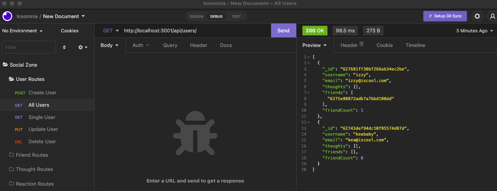

<h1 align="center">SocialZone</h1>

## Table of Contents

* [Description](#description)
* [BuiltWith](#built-with)
* [Installation](#installation)
* [Video Walkthrough](#video-walkthrough)
* [Contributor](#contributor)

## Description

SocialZone is a social network API that allows users to share thoughts, have friend lists, and react to thoughts. This back end applications takes unstructured data to the next level with it's use of MongoDB 
for the database and Mongoose ODM, which is an object data modeling library. This application uses the Mongoose built in methods for CRUD operations to be able to create, update, and delete users, thoughts, friends,
and reactions. Let's get social!

## Built With

* JavaScript
* Node.js
* Express
* MongoDB
* Mongoose
* date-and-time

## Installation

Initial install

1. `npm init -y`
2. `npm i express mongoose date-and-time`

Start server

1. `npm start`

## Video Walkthrough

[SocialZone Video](https://evening-tor-85614.herokuapp.com/).

</img>

## Contributor

Chloe Yarborough

Connect with me on [GitHub](https://github.com/chloeyarb)!
